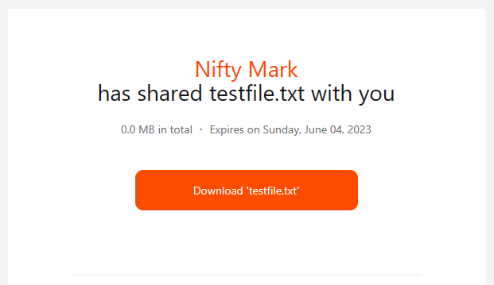

# Nifty Share

You can use Nifty Share to send small or large files/folders with your own cloud provider from the command-line.


## Usage

```ps1
usage: nifty.py [-h] [-p PROVIDER] [-t TEMPLATE] file_path recipient  

Share a link to a file via email.

positional arguments:
  file_path             path/to/your/file-or-folder
  recipient             Email address of the recipient

options:
  -h, --help            show this help message and exit
  -p PROVIDER, --provider PROVIDER
                        Cloud provider (default: AWS)
  -t TEMPLATE, --template TEMPLATE
                        Email template filename (default: mailer.html)
```


### CLI Examples:
```ps1
python nifty.py "path/to/file.ext" recipient@example.com --provider AWS --template mailer.html
```

```ps1
python nifty.py "path/to/folder" recipient@example.com --provider Google
```


### Set Up

- Clone this repository
- Include the necessary *`./settings.py`*
- If you're using Google Cloud Storage remember to include your own *`./google.json`* file
- Using your own credentials, create a `settings.py` file (in the same directory as `nifty.py`) that looks like this the settings example below.


#### *`./settings.py`* Example:

```python

class AwsConfig:

    DEFAULT_ROOT_FOLDER = 'target/folder/inside/your/bucket'

    AWS_ACCESS_KEY = "your-access-key"
    AWS_SECRET_ACCESS_KEY = "your-secret-access-key"
    AWS_BUCKET_NAME = "your-bucket-name"
    AWS_DEFAULT_REGION = "af-south-1"

    # for AWS in South Africa region "af-south-1" I've found it's important to provide
    # an endpoint url for any other region, you can comment out the endpoint url
    AWS_ENDPOINT_URL = "https://s3.af-south-1.amazonaws.com"

    # Wasabi Example:
    AWS_ENDPOINT_URL = "https://s3.us-east-1.wasabisys.com"


class GoogleConfig:

    DEFAULT_ROOT_FOLDER = 'target/folder/inside/your/bucket'

    GGL_BUCKET_NAME = 'nifty-storage'
    GGL_CREDENTIALS_PATH = 'google.json'


class MailerConfig:

    MAIL_HOST_USERNAME = "aws_access_key OR youremail@example.com"
    MAIL_PASSWORD = "aws_secret_access_key OR your16charAppPassword"
    MAIL_SMTP_SERVER = "email-smtp.eu-west-1.amazonaws.com OR smtp.gmail.com"
    MAIL_SMTP_PORT = 587
    MAIL_HOST_SENDER_NAME = "The name you want to show on the email"
    MAIL_HOST_SENDER_ADDRESS = "youremail@example.com"

class DatabaseConfig:

    DB_TYPE = "sqlite"
    SQLITE_DB_FILENAME = "nifty.db"

    SQLITE_COLS = "id INTEGER PRIMARY KEY AUTOINCREMENT, " \
                "sender_name VARCHAR(100), " \
                "file_basename VARCHAR(100), " \
                "sender_address VARCHAR(100), " \
                "download_link TEXT, " \
                "recipient_email VARCHAR(100), " \
                "expiry_date DATETIME, " \
                "file_size_mb REAL, " \
                "files_list TEXT, " \
                "date_added DATETIME DEFAULT CURRENT_TIMESTAMP"

    # MySQL Config Example in settings_example.py

```

## Settings Notes:
You can use either AWS SES or your own Gmail account to send emails. The required settings variables are the same for either service but for AWS, the MAIL_HOST_USERNAME must be your ACCESS_KEY and the MAIL_PASSWORD must be your SECRET_ACCESS_KEY.

For Gmail, since 'less secure apps' was deprecated some time ago, you need to generate and use an App Password:

- Make sure 2-Step Authentication is enabled on your google account,
- Generate a 16-char App Password for the app you're using to send email.
- https://support.google.com/accounts/answer/185833?hl=en


---
## Email Templates

You can create your own custom templates, they're just Jinja2 formatted HTML, very similar to Django, however you'll need to use inline CSS, *it's a mail thing*.

Here's what the default template `mailer.html` will output:




---
## Cloud Providers
AWS S3 is available as a Cloud Storage provider which also supports Wasabi (ensure you use the wasabi endpoint url).
Google Cloud Storage is also available, you'll need to need to create your service-account.json in the Google Cloud Console and then add the path to GoogleConfig.GGL_CREDENTIALS_PATH.


---
## To Do:

- [X] Improve coverage of logging and Exception handling
- [X] Add Google Cloud Storage
    - [ ] Adapt for Threaded Multipart Uploads for GCS
- [ ] Add Azure
- [X] Add ability to select a folder containing many files and zip it before sending
- [X] Add Database options for tracking your sends and expiry dates
    - [ ] Add ability to re-share expired links from stored data
